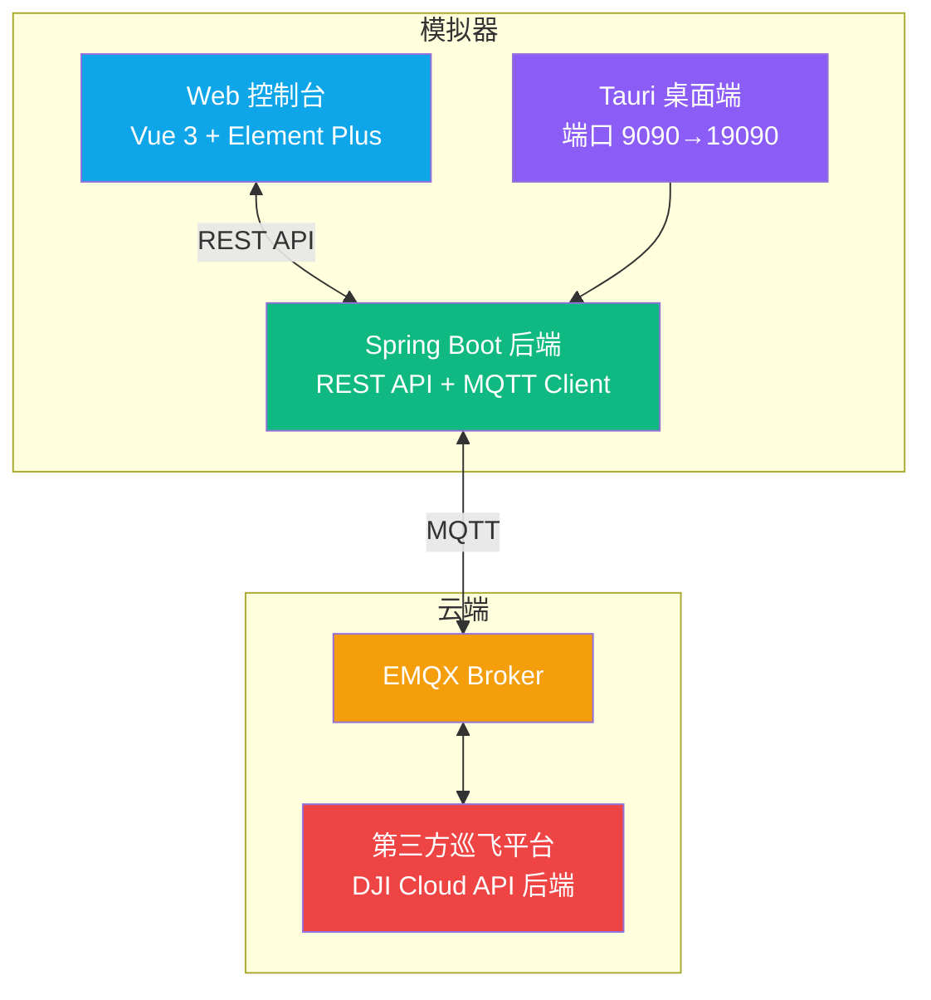
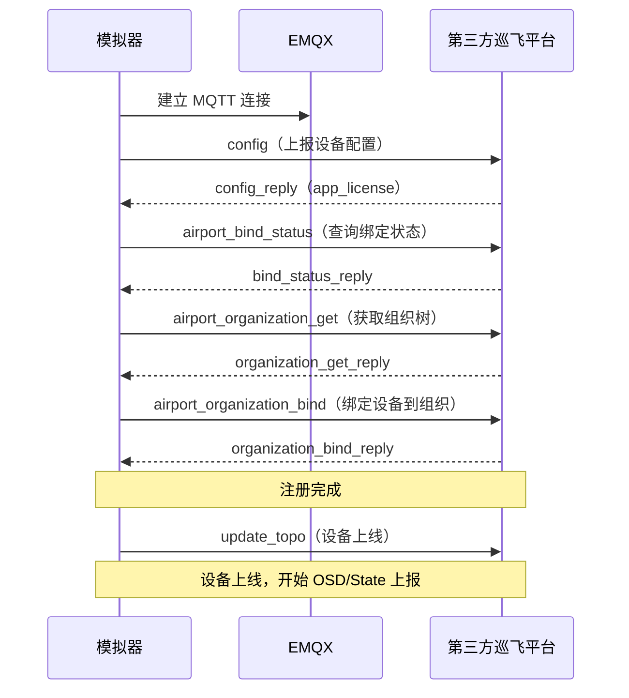

# DJI Dock 模拟器

**English** | [中文](#一句话定位比真机更快捷地验证平台代码正确性)

A DJI Dock (Dock1/Dock2/Dock3) simulator & MQTT monitor for testing DJI Cloud API backends — no real hardware required. Simulates the full device lifecycle: cloud registration, online/offline topology, OSD/State telemetry, wayline missions, live streaming, media upload, and HMS alerts. Supports M30/M3D/M4D series drones and Pilot-to-Cloud remote controllers (RC Plus/RC Pro).

**One-line pitch: verify your platform code faster than real hardware** — controllable state, reproducible scenarios, iteration cycles shrink from days to seconds.

---


> 开发大疆 Cloud API 后端，最头疼的不是代码难写，是没有设备。

代码写完了，手头没有机场，没有飞行器。注册流程跑不通，OSD 上报没法测，航线任务、直播推流、媒体上传、HMS 告警，每一环都需要真实设备来验证。更现实的问题是设备不够分——开发要调航线任务，测试要跑回归，一套机场两拨人抢。等真机到位，开发周期已经拉长几个星期。同一个 bug 想复现第二次，得等天气、等电量、等空域。

hivemind-simulator 把 Dock1/Dock2/Dock3 三代机场、配套飞行器（M30/M3D/M4D 系列）和 Pilot 上云遥控器（RC Plus/RC Pro）全装进了一个程序里。不需要任何真实硬件，按 DJI Cloud API 协议经 MQTT 与你的后端平台通信。

**一句话定位：比真机更快捷地验证平台代码正确性**——状态可控、场景可复现、迭代周期从"天"缩到"秒"。

## 解决什么问题

| 痛点 | 解法 |
|---|---|
| 没有设备，代码写完没法跑 | 一台电脑模拟全套设备，不需要任何真实硬件 |
| 设备不够分，开发测试互相抢 | 每人装一份，各自独立运行，互不干扰 |
| 真机状态不可控，bug 难复现 | 状态完全可控，场景随时可复现 |
| 型号不全，没法覆盖所有机型 | 切下拉框换机型，不花一分钱测遍所有组合 |
| 机群测试买不起十几套机场 | 开多个实例，模拟多机同时在线并发压测 |

> 设计详情见 [设计文档](docs/superpowers/specs/2026-08-08-dji-dock-simulator-design.md)。

## 适用场景

| 角色 | 价值 |
|---|---|
| DJI Cloud API 后端开发者 | 状态可控、场景可复现地验证平台代码，无需真实机场硬件 |
| 无人机云平台集成商 | 联调测试 DJI 协议对接，快速回归 |
| 司空私有版运维人员 | 通过监控器抓取 MQTT 消息排查线上问题，定位协议异常 |
| DJI 机场协议学习者 | 通过时序图、消息日志、诊断系统理解 Cloud API 交互细节 |

## 界面截图

<p align="center">
  
</p>

<details>
<summary>更多功能截图</summary>

<br/>

<p align="center">
  
</p>

| 异常模拟 | 消息日志（MQTT 报文） |
|---|---|
|  |  |

| 位置模拟（地图模式） | 监控器（已连接） |
|---|---|
|  |  |

</details>

## 功能特性

### 两种模式，覆盖大疆云端对接两条核心链路

- **Dock 模式**：模拟机场+飞行器的完整场景，从设备注册、上线、OSD 上报到航线任务、直播推流、媒体上传
- **Pilot 模式**（v1.1.0 新增）：模拟遥控器直接上云，RC Plus / RC Plus 2 / RC Pro 搭配各种飞行器，走独立的 DRC 协议策略

### 协议覆盖

- **完整注册流程**：config → airport_bind_status → airport_organization_get → airport_organization_bind → update_topo 上线
- **OSD/State 上报**：按设备类型构造差异化字段（Builder+策略模式），不同机型字段精确区分
- **航线任务模拟**：flighttask_prepare 到 flighttask_execute，6 步进度推进，支持暂停/恢复/取消/停止，任务完成后自动触发媒体上传
- **直播推流**：FFmpeg WHIP 真实 WebRTC 推流（非纯协议应答），视频循环播放持续推流，不支持 WHIP 时自动降级 RTMP
- **媒体上传**：storage_config_get 拿 STS 凭证，S3 兼容协议上传到对象存储（阿里 OSS/AWS/MinIO/华为 OBS），file_upload_callback 逐个上报等平台确认
- **DRC 远程指挥**：摇杆控制、应急停止、迫降、相机夜视、补光灯、喊话器，20+ 下行指令
- **指令飞行**：一键起飞、flyto 目标点、飞行和负载控制权抢夺，异步双阶段确认
- **远程调试**：同步 Cmd 和异步 Job 指令，开盖/推杆/充电/重启/格式化/eSIM/RTK 标定，三 Dock 指令集差异精确处理
- **HMS 告警**：7 种告警场景（风速/雨量/图传/高度/距离/电量），可组合触发验证返航决策
- **其他**：自定义飞行区、远程解禁（7 种证书类型）、PSDK 喊话器、ESDK 互联互通、远程日志、OTA 固件升级、AirSense

### 两个工具，一个闭环

- **模拟器**：扮演设备，与平台通信，左侧实时滚动展示 MQTT 收发报文
- **监控器**：独立 MQTT 客户端，以第三方视角监听平台消息，支持主动下发指令（飞行控制、负载控制、远程调试等）
- **诊断系统**：协议覆盖率统计、MQTT 消息规格校验、三层错误码体系（P/S/M 区分平台侧/模拟器侧/协议推断侧）
- **桌面端打包**：Tauri 打包为 Windows 安装包，内置 JRE，不需要装 Java

## 架构概览



## 注册流程



## 技术栈

| 层 | 技术 |
|---|---|
| 后端 | Java 21、Spring Boot 3.x、MQTT Paho v3 |
| 前端 | Vue 3、Element Plus |
| 桌面端 | Tauri（Rust） |
| 构建 | Maven 3.8+ |
| 协议 | DJI Cloud API（[官方文档](https://developer.dji.com/doc/cloud-api-tutorial/cn/)） |

## 环境要求

- JDK 21+
- Maven 3.8+
- 运行中的 EMQX broker（与第三方巡飞平台共用）
- 运行中的第三方巡飞平台

## 快速开始

### 方式一：桌面端安装（推荐）

1. 下载最新版 [DJI Dock Simulator_x64-setup.exe](https://github.com/cdmiltd/hivemind-simulator/releases/latest) 安装包
2. 运行安装程序
3. 启动应用，自动打开控制台
4. 填写配置后点击"注册到第三方平台"

### 方式二：源码编译

```bash
# 编译
mvn compile

# 打包
mvn package -DskipTests

# 运行
java -jar target/dji-dock-simulator-1.1.2.jar

# 或直接运行
mvn spring-boot:run
```

### 方式三：Docker 部署

无需手动安装 Java，一条命令启动模拟器。

```bash
# 一键构建并启动（Windows）
.\docker-build.ps1

# 或手动执行
mvn package -DskipTests
docker compose up -d
```

启动后访问模拟器：http://localhost:9090，注册弹窗中填写第三方平台的 MQTT 地址。

两种场景：

- **对接第三方平台（常用）**：平台自带 MQTT Broker，上述命令默认只启动模拟器，不启动本地 EMQX。
- **本地调试（无平台环境）**：`docker compose --profile local-mqtt up -d` 额外启动本地 EMQX（Dashboard：http://localhost:18083，admin/public），可订阅 `sim-*` topic 观察模拟器上报的 OSD/State 数据。注意纯 Broker 无平台后端，注册流程的 RPC 无人应答，仅适合观察上报数据流。

常用命令：

```bash
docker compose logs -f simulator   # 查看模拟器日志
docker compose restart simulator   # 重启模拟器
docker compose down                # 停止（带 --profile local-mqtt 才会停掉本地 EMQX）
docker compose up -d --build       # 重新构建并启动
```

> **说明**：直播真实推流和媒体上传的素材文件，通过模拟器页面「直播推流配置」弹窗中的「上传视频」/「上传媒体」按钮传入（Docker 卷内），无需 `docker cp`。

### 配置

编辑 `src/main/resources/application.yml`：

```yaml
# MQTT 公共配置（模拟器与监控器共享）
mqtt:
  host: 127.0.0.1
  port: 1883
  username: your-mqtt-username
  password: your-mqtt-password
  simulator-client-id-prefix: dock-sim-
  monitor-client-id-prefix: monitor-

simulator:
  location:
    latitude: 30.670815
    longitude: 104.071523
    height: 500.0

server:
  port: 9090
```

> 桌面端用户可在 Web 控制台注册时填写 DJI License、绑定码等覆盖配置，无需修改 application.yml。

## Web 控制台使用指南

启动后浏览器打开 `http://localhost:9090`。

### 注册到第三方平台

1. 点击"注册到第三方平台"打开配置弹窗
2. 选择机场类型、飞行器类型
3. 填写 DJI License（可选）、组织 ID、绑定码
4. 填写 MQTT 地址、账号、密码
5. 点击注册，模拟器自动执行上云注册流程（config → 绑定状态查询 → 组织绑定）
6. 注册成功后设备自动上线

> **重要**：首次注册时输入的 DJI License 会被锁定存储到 `localStorage['locked_app_license']`。后续注册时注册界面会**隐藏 DJI License 输入行**（显示「已锁定」标签），前端自动使用锁定的 license 提交，用户无需再次输入。DJI License 是第三方平台通过 config 回复下发给模拟器的，用户在模拟器侧再次输入不起作用。留空则跳过 License 校验，适用于调试阶段。
>
> 桌面应用中 localStorage 无法手动清除，**如果首次输入错误，必须卸载重装应用**。浏览器环境可通过 F12 开发者工具清除 localStorage 中的 `locked_app_license` 重置。
>
> 其他配置（MQTT 地址、组织 ID、绑定码等）会保存到 localStorage，下次自动填充，可随时修改。

### 设备控制

- 注册成功后自动上线
- 可手动下线
- 飞行器激活/休眠切换（飞行器在舱时可操作）
- 舱盖开合、推杆伸展状态切换

### 状态参数

调整电量/温度/湿度/风速/降雨/舱盖等，实时影响 OSD 上报。

### 任务模拟

查看当前任务进度和媒体文件列表（由第三方巡飞平台下发任务触发）。

### 位置模拟

- **地图模式**：输入高德地图 JS API Key 后启用，支持地图选点、拖拽 Marker、地址搜索定位
- **手动模式**：直接输入经纬度和高度
- 地图选点自动获取海拔高度（Open-Meteo Elevation API）
- 地图模式下选点/拖拽自动保存，手动模式下需点击保存按钮
- 机场位置作为起飞点与返航点，保存后重启依然有效
- 实时显示无人机位置（纬度/经度/高度/状态），飞行时按步骤更新
- 飞行器未激活时位置显示为 `-`

### 直播推流配置

- 支持 FFmpeg WHIP 真实推流（WebRTC）
- 一键安装 FFmpeg（通过 winget）
- 视频文件目录配置，支持循环播放持续推流
- 协议模拟模式（无 FFmpeg 时仅协议应答）

### 消息日志

实时查看 MQTT 收发报文，点击查看完整 payload。

### 诊断系统

- 协议覆盖率统计：统计已实现的 DJI 方法
- 规格校验：校验 MQTT 消息格式是否符合 DJI 协议
- 诊断日志：记录协议异常和覆盖情况

### 监控器页面

`http://localhost:9090/monitor.html` — 独立 MQTT 客户端监听平台消息，用于调试观察。

## 与第三方巡飞平台联调步骤

1. 启动 EMQX broker
2. 启动第三方巡飞平台
3. 启动本模拟器：`mvn spring-boot:run`
4. 打开 `http://localhost:9090`，填写配置后点击"注册到第三方平台"
5. 注册成功后设备自动上线，在第三方巡飞平台设备列表确认
6. 在第三方巡飞平台下发航线任务，观察模拟器自动推进进度并上报媒体文件
7. 在第三方巡飞平台下发直播命令，观察模拟器应答
8. 在第三方巡飞平台下发 DRC 指令，观察飞行控制响应

## 开发导航

### 项目结构

```
hivemind-simulator/
├── src/main/java/ltd/cdmi/hivemind/simulator/
│   ├── config/          # 配置绑定（SimulatorProperties/MqttProperties/RuntimeConfig/LiveConfigStore）
│   ├── mqtt/            # MQTT 连接（MqttClientManager/MonitorMqttClient）
│   ├── device/          # 设备状态、上云流程、OSD Builder 策略（DeviceState/DeviceSimulator/DockOnlineService/OsdBuilder）
│   ├── handler/         # 协议处理器（航线/直播/媒体/HMS/DRC/飞行指令/FFmpeg推流/属性设置）
│   └── web/             # REST API 与页面入口
├── src/main/resources/
│   ├── application.yml
│   ├── hms.json         # HMS 错误码映射
│   ├── dji-method-catalog.json  # DJI 方法目录
│   └── static/          # index.html（模拟器） + monitor.html（监控器） + vendor/（Vue/Element Plus CDN 本地化）
├── src/test/java/ltd/cdmi/hivemind/simulator/  # 单元测试（OSD/航线/直播/媒体/远程调试）
└── src-tauri/           # Tauri 桌面端打包
```

### 相关文档

| 文档 | 内容 |
|---|---|
| [设计文档](docs/superpowers/specs/2026-08-08-dji-dock-simulator-design.md) | 架构、DJI 时序图、协议覆盖、数据流、错误码体系、update_topo 核实结论 |
| [TDD 规格测试文档](docs/TDD-SPEC.md) | 容易搞错的规格陷阱、测试用例、TDD 开发模式 |
| [模拟器与真机差异说明](docs/SIMULATOR-VS-REAL-DEVICE.md) | 模拟器与真机的全部已知差异（结构性简化 + 协议留白推断）、自查方法、真机对拍建议 |

### DJI Cloud API 参考

- [DJI Cloud API 官方文档](https://developer.dji.com/doc/cloud-api-tutorial/cn/)
- 支持的协议方法详见 `src/main/resources/dji-method-catalog.json`

## 开发工作流

### 版本管理

采用[语义化版本](https://semver.org/lang/zh-CN/) `vMAJOR.MINOR.PATCH`，变更记录见 [CHANGELOG.md](CHANGELOG.md)。

### 参与贡献

贡献流程、TDD 开发模式、代码规范、提交规范详见 [CONTRIBUTING.md](CONTRIBUTING.md)。

## Roadmap

以下为暂未支持、计划演进的方向，欢迎在 Issue 中讨论或认领（标注 `good first issue` 的适合首次贡献）：

- [x] 真实 KMZ/WPML 航线解析与实时飞行 OSD（支持 HTTP(S)、file URL 和本地路径）
- [ ] 多机模拟（当前为单机）

> 当前与历史变更见 [CHANGELOG.md](CHANGELOG.md)。

## 交流与支持

<p align="center">
  
  &nbsp;&nbsp;
  
</p>

- 技术交流群：扫码进群（左）
- 问题反馈与功能建议：请提交 [Issue](https://github.com/cdmiltd/hivemind-simulator/issues)
- 贡献代码：请阅读 [CONTRIBUTING.md](CONTRIBUTING.md)
- 微信沟通：扫码添加（右）

## 支持作者

如果这个项目对你的工作有帮助，欢迎打赏支持，激励持续维护与功能演进。

<p align="center">
  
</p>

## 开源协议

本项目采用 [GNU Affero General Public License v3.0](LICENSE) 开源协议。

- 允许自由使用、修改和分发
- 衍生作品必须以相同协议开源
- 通过网络提供服务（SaaS）也必须公开源代码
- 商业使用需遵守 AGPLv3 条款

> **为何选择 AGPLv3**：本项目定位为调试工具，希望保持开放共享；AGPLv3 确保任何通过网络提供本软件或其衍生品的服务都必须公开源代码，避免被直接商业化套壳而不回馈社区。如需商业授权，请联系维护者。
